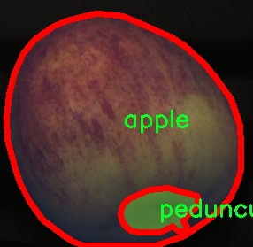

# 水果缺陷分割系统源码＆数据集分享
 [yolov8-seg-C2f-EMBC＆yolov8-seg-RCSOSA等50+全套改进创新点发刊_一键训练教程_Web前端展示]

### 1.研究背景与意义

项目参考[ILSVRC ImageNet Large Scale Visual Recognition Challenge](https://gitee.com/YOLOv8_YOLOv11_Segmentation_Studio/projects)

项目来源[AAAI Global Al lnnovation Contest](https://kdocs.cn/l/cszuIiCKVNis)

研究背景与意义

随着全球经济的发展和人们生活水平的提高，水果作为重要的食品之一，其消费需求日益增长。然而，水果在生产、运输和储存过程中，常常会受到各种缺陷的影响，如腐烂、破损、虫害等。这些缺陷不仅影响了水果的外观和口感，还可能对消费者的健康造成威胁。因此，及时、准确地识别和分割水果缺陷，对于提高水果的质量管理和保障食品安全具有重要意义。

近年来，计算机视觉技术的迅猛发展为水果缺陷检测提供了新的解决方案。特别是基于深度学习的目标检测和实例分割技术，已经在许多领域取得了显著的成果。其中，YOLO（You Only Look Once）系列模型因其高效的实时检测能力而受到广泛关注。YOLOv8作为该系列的最新版本，结合了多种先进的网络结构和优化算法，具有更高的检测精度和更快的处理速度。然而，现有的YOLOv8模型在水果缺陷分割任务中的应用仍然存在一定的局限性，尤其是在复杂背景和多种缺陷类别的情况下，模型的分割性能亟待提升。

本研究旨在基于改进的YOLOv8模型，构建一个高效的水果缺陷分割系统。为此，我们将使用一个包含2900张图像的水果数据集，该数据集涵盖了7个类别，包括正常的苹果、坏苹果、花萼、缺损、切割、腐烂和果梗等。这些类别的多样性为模型的训练和测试提供了丰富的样本，能够有效提升模型对不同缺陷的识别能力。通过对数据集的深入分析，我们将探索如何通过数据增强、模型结构优化和损失函数调整等手段，提升YOLOv8在水果缺陷分割任务中的表现。

本研究的意义不仅在于提升水果缺陷检测的准确性和效率，更在于推动计算机视觉技术在农业领域的应用。通过实现自动化的水果缺陷检测，我们可以减少人工检测的成本，提高生产效率，并在一定程度上降低食品安全风险。此外，改进后的YOLOv8模型也可以为其他领域的实例分割任务提供借鉴，具有广泛的应用前景。

综上所述，基于改进YOLOv8的水果缺陷分割系统的研究，不仅有助于解决当前水果产业面临的质量管理问题，还将推动深度学习技术在实际应用中的发展，为实现农业智能化提供有力支持。通过本研究，我们希望能够为水果生产和销售提供科学依据，促进水果产业的可持续发展。

### 2.图片演示


##### 注意：由于此博客编辑较早，上面“2.图片演示”和“3.视频演示”展示的系统图片或者视频可能为老版本，新版本在老版本的基础上升级如下：（实际效果以升级的新版本为准）

  （1）适配了YOLOV8的“目标检测”模型和“实例分割”模型，通过加载相应的权重（.pt）文件即可自适应加载模型。

  （2）支持“图片识别”、“视频识别”、“摄像头实时识别”三种识别模式。

  （3）支持“图片识别”、“视频识别”、“摄像头实时识别”三种识别结果保存导出，解决手动导出（容易卡顿出现爆内存）存在的问题，识别完自动保存结果并导出到tempDir中。

  （4）支持Web前端系统中的标题、背景图等自定义修改，后面提供修改教程。

  另外本项目提供训练的数据集和训练教程,暂不提供权重文件（best.pt）,需要您按照教程进行训练后实现图片演示和Web前端界面演示的效果。

### 3.视频演示

[3.1 视频演示](https://www.bilibili.com/video/BV1CxyzYeETz/)

### 4.数据集信息展示

##### 4.1 本项目数据集详细数据（类别数＆类别名）

nc: 7
names: ['apple', 'bad_apple', 'calice', 'def_chipped', 'def_cut', 'def_rotten', 'pedunculo']


##### 4.2 本项目数据集信息介绍

数据集信息展示

在本研究中，我们使用了名为“Fruit”的数据集，以训练和改进YOLOv8-seg模型，旨在实现水果缺陷的高效分割。该数据集包含七个不同的类别，具体包括：苹果（apple）、坏苹果（bad_apple）、果萼（calice）、缺损的切口（def_chipped）、切割缺损（def_cut）、腐烂缺损（def_rotten）以及果梗（pedunculo）。这些类别的选择不仅涵盖了水果的正常状态，还包括了多种常见的缺陷类型，旨在为模型提供全面的训练样本，从而提升其在实际应用中的表现。

数据集的设计考虑到了水果在不同生长阶段和不同环境条件下的外观变化。苹果作为一种广泛种植和消费的水果，其质量直接影响到市场销售和消费者满意度。因此，能够准确识别和分割出水果的各种缺陷，尤其是在生产和运输过程中出现的损伤，对于提高水果的整体质量控制具有重要意义。数据集中“坏苹果”类别的引入，正是为了帮助模型学习如何区分健康与受损的水果，从而为后续的质量评估提供支持。

此外，数据集中包含的“果萼”类别是一个相对独特的选择，通常在水果的外观分析中被忽视。果萼的状态可以反映出水果的成熟度和健康状况，因此对其进行有效的分割和分析，将有助于更全面地评估水果的整体品质。而“缺损的切口”和“切割缺损”类别则针对水果在加工和包装过程中可能出现的物理损伤，这些损伤不仅影响外观，还可能导致水果的保鲜期缩短，进而影响消费者的购买决策。

“腐烂缺损”类别则是对水果在存储和运输过程中可能发生的生物性损害的具体体现。腐烂不仅影响水果的外观，更是食品安全的重要隐患。因此，能够及时识别出腐烂的水果，能够有效降低食品安全风险，保护消费者的健康。最后，“果梗”类别的引入则是为了帮助模型更好地理解水果的整体结构，确保在进行缺陷分割时不会遗漏任何重要的组成部分。

通过对“Fruit”数据集的深入分析，我们能够发现其在水果缺陷识别与分割中的潜在价值。数据集的多样性和全面性为YOLOv8-seg模型的训练提供了丰富的样本，使得模型在面对实际应用场景时，能够具备更强的适应性和准确性。随着模型的不断优化，我们期望能够实现对水果缺陷的高效识别和分割，从而为水果的质量控制和市场监管提供有力的技术支持。最终，这将有助于提升水果产业的整体效率，推动可持续发展目标的实现。




### 5.全套项目环境部署视频教程（零基础手把手教学）

[5.1 环境部署教程链接（零基础手把手教学）](https://www.bilibili.com/video/BV1jG4Ve4E9t/?vd_source=bc9aec86d164b67a7004b996143742dc)


[5.2 安装Python虚拟环境创建和依赖库安装视频教程链接（零基础手把手教学）](https://www.bilibili.com/video/BV1nA4VeYEze/?vd_source=bc9aec86d164b67a7004b996143742dc)

### 6.手把手YOLOV8-seg训练视频教程（零基础小白有手就能学会）

[6.1 手把手YOLOV8-seg训练视频教程（零基础小白有手就能学会）](https://www.bilibili.com/video/BV1cA4VeYETe/?vd_source=bc9aec86d164b67a7004b996143742dc)


按照上面的训练视频教程链接加载项目提供的数据集，运行train.py即可开始训练



     Epoch   gpu_mem       box       obj       cls    labels  img_size
     1/200     0G   0.01576   0.01955  0.007536        22      1280: 100%|██████████| 849/849 [14:42<00:00,  1.04s/it]
               Class     Images     Labels          P          R     mAP@.5 mAP@.5:.95: 100%|██████████| 213/213 [01:14<00:00,  2.87it/s]
                 all       3395      17314      0.994      0.957      0.0957      0.0843

     Epoch   gpu_mem       box       obj       cls    labels  img_size
     2/200     0G   0.01578   0.01923  0.007006        22      1280: 100%|██████████| 849/849 [14:44<00:00,  1.04s/it]
               Class     Images     Labels          P          R     mAP@.5 mAP@.5:.95: 100%|██████████| 213/213 [01:12<00:00,  2.95it/s]
                 all       3395      17314      0.996      0.956      0.0957      0.0845

     Epoch   gpu_mem       box       obj       cls    labels  img_size
     3/200     0G   0.01561    0.0191  0.006895        27      1280: 100%|██████████| 849/849 [10:56<00:00,  1.29it/s]
               Class     Images     Labels          P          R     mAP@.5 mAP@.5:.95: 100%|███████   | 187/213 [00:52<00:00,  4.04it/s]
                 all       3395      17314      0.996      0.957      0.0957      0.0845


### 7.50+种全套YOLOV8-seg创新点代码加载调参视频教程（一键加载写好的改进模型的配置文件）

[7.1 50+种全套YOLOV8-seg创新点代码加载调参视频教程（一键加载写好的改进模型的配置文件）](https://www.bilibili.com/video/BV1Hw4VePEXv/?vd_source=bc9aec86d164b67a7004b996143742dc)

### 8.YOLOV8-seg图像分割算法原理

原始YOLOv8-seg算法原理

YOLOv8-seg算法是YOLO系列中的一个重要进展，旨在实现高效的目标检测与分割任务。作为YOLOv8的扩展版本，YOLOv8-seg不仅继承了YOLOv8在目标检测方面的优越性能，还在此基础上增加了图像分割的能力，使其能够处理更复杂的视觉任务。YOLOv8-seg通过引入先进的网络结构和创新的算法思想，进一步提升了目标检测和分割的精度与速度。

首先，YOLOv8-seg的网络结构依然遵循YOLO系列的设计理念，分为主干网络、特征增强网络和检测头三个主要部分。主干网络采用了CSP（Cross Stage Partial）结构，旨在通过分层的特征提取提高模型的表达能力。CSP结构的引入有效地减少了模型的计算复杂度，同时保留了丰富的特征信息，为后续的目标检测和分割提供了坚实的基础。

在特征增强网络方面，YOLOv8-seg使用了PAN-FPN（Path Aggregation Network - Feature Pyramid Network）的思想。该结构通过多尺度特征融合，能够有效地捕捉不同尺度目标的特征信息。特征金字塔的设计使得模型在处理多样化目标时表现出色，尤其是在复杂场景中，能够更好地应对不同大小和形状的目标。

YOLOv8-seg的检测头部分则采用了解耦结构，这一创新设计将目标分类和边界框回归任务分开处理。通过解耦，模型能够更加专注于各自的任务，从而提高了分类精度和定位准确性。这种结构的引入有效地解决了在复杂场景下常见的定位不准和分类错误的问题，极大地提升了模型的整体性能。

值得一提的是，YOLOv8-seg采用了Anchor-free的目标检测方法，这一方法的核心在于不再依赖于预定义的锚点框。传统的目标检测方法往往需要设计多种锚点框以适应不同尺度和形状的目标，这不仅增加了模型的复杂性，也使得模型在训练过程中面临更多的挑战。而YOLOv8-seg通过直接回归目标的位置和大小，简化了模型的设计，使得网络能够更快地聚焦于目标位置的邻近点，从而提高了预测框的准确性。

在损失函数的设计上，YOLOv8-seg也进行了创新。通过引入变焦损失（Zoom Loss）来计算分类损失，并结合数据平均保真度损失和完美交并比损失来计算边界框损失，这一策略使得模型在目标检测和分割任务中能够更加准确地进行学习。新的损失策略不仅提高了模型的训练效果，也使得YOLOv8-seg在实际应用中表现得更加稳定和可靠。

YOLOv8-seg在处理图像分割任务时，采用了像素级的预测方式，使得每个像素都能被分类为特定的目标类别。这一过程需要在特征图上进行细致的处理，以确保分割结果的精确性。通过对特征图的精细化处理，YOLOv8-seg能够在目标边界处提供更为准确的分割结果，尤其是在复杂背景下，能够有效地区分目标与背景之间的细微差别。

此外，YOLOv8-seg在处理小目标时也展现出了良好的性能。小目标往往由于其特征不明显而难以被准确检测和分割，YOLOv8-seg通过优化网络结构和调整损失函数，增强了对小目标的感知能力。这一特性使得YOLOv8-seg在实际应用中，尤其是在复杂环境下的目标检测与分割任务中，能够更好地满足需求。

总的来说，YOLOv8-seg算法通过一系列创新的设计和优化，成功地将目标检测与分割任务结合在一起，形成了一个高效、准确的视觉识别系统。其在实时性和精确性上的双重优势，使得YOLOv8-seg在众多应用场景中展现出了广泛的适用性。无论是在智能监控、自动驾驶还是医疗影像分析等领域，YOLOv8-seg都能够提供强大的支持，推动计算机视觉技术的进一步发展。通过不断的研究与实践，YOLOv8-seg无疑将成为未来目标检测与分割领域的重要工具，为相关研究和应用提供更加丰富的可能性。


### 9.系统功能展示（检测对象为举例，实际内容以本项目数据集为准）

图9.1.系统支持检测结果表格显示

  图9.2.系统支持置信度和IOU阈值手动调节

  图9.3.系统支持自定义加载权重文件best.pt(需要你通过步骤5中训练获得)

  图9.4.系统支持摄像头实时识别

  图9.5.系统支持图片识别

  图9.6.系统支持视频识别

  图9.7.系统支持识别结果文件自动保存

  图9.8.系统支持Excel导出检测结果数据


### 10.50+种全套YOLOV8-seg创新点原理讲解（非科班也可以轻松写刊发刊，V11版本正在科研待更新）

#### 10.1 由于篇幅限制，每个创新点的具体原理讲解就不一一展开，具体见下列网址中的创新点对应子项目的技术原理博客网址【Blog】：


[10.1 50+种全套YOLOV8-seg创新点原理讲解链接](https://gitee.com/qunmasj/good)

#### 10.2 部分改进模块原理讲解(完整的改进原理见上图和技术博客链接)【如果此小节的图加载失败可以通过CSDN或者Github搜索该博客的标题访问原始博客，原始博客图片显示正常】
### 全维动态卷积ODConv
鉴于上述讨论，我们的ODConv引入了一种多维注意机制，该机制具有并行策略，用于学习卷积核在核空间的所有四个维度上的不同注意。图提供了CondConv、DyConv和ODConv的示意性比较。

ODConv的公式：根据等式1中的符号，ODConv可定义为


 将注意力标量分配给整个卷积核。图2示出了将这四种类型的关注乘以n个卷积核的过程。原则上，这四种类型的关注是相互补充的，并且以位置、信道、滤波器和核的顺序将它们逐步乘以卷积核 
 ，使得卷积运算不同w.r.t.所有空间位置、所有输入信道、所有滤波器和输入x的所有核，提供捕获丰富上下文线索的性能保证。因此，ODConv可以显著增强CNN基本卷积运算的特征提取能力。此外，具有单个卷积核的ODConv可以与标准CondConv和DyConv竞争或优于它们，为最终模型引入的额外参数大大减少。提供了大量实验来验证这些优点。通过比较等式1和等式2，我们可以清楚地看到，ODConv是一种更广义的动态卷积。此外，当设置n=1且 所有分量均为1时，只关注滤波器方向 的ODConv将减少为：将基于输入特征的SE变量应用于卷积滤波器，然后进行卷积运算（注意原始SE（Hu等人，2018b）基于输出特征，并且用于重新校准输出特征本身）。这种SE变体是ODConv的特例。


图：将ODConv中的四种注意类型逐步乘以卷积核的示例。（a） 沿空间维度的逐位置乘法运算，（b）沿输入信道维度的逐信道乘法运算、（c）沿输出信道维度的按滤波器乘法运算，以及（d）沿卷积核空间的核维度的按核乘法运算。方法部分对符号进行了说明
实现：对于ODConv，一个关键问题是如何计算卷积核的四种关注度 。继CondConv和DyConv之后，我们还使用SE型注意力模块（Hu等人，2018b），但将多个头部作为来计算它们，其结构如图所示。具体而言，首先通过逐通道全局平均池（GAP）运算将输入压缩到具有长度的特征向量中。随后，存在完全连接（FC）层和四个头部分支。ReLU（Krizhevsky等人，2012）位于FC层之后。FC层将压缩特征向量映射到具有缩减比的低维空间（根据消融实验，我们在所有主要实验中设置 ，避免了高模型复杂度）。对于四个头部分支，每个分支都有一个输出大小如图。

### 引入ODConv的改进YOLO
参考这篇博客涵盖了引入ODConv的改进YOLOv8系统的内容，ODConv采用多维注意机制，在卷积核空间的四个维度上学习不同的注意。结合了CondConv和DyConv的优势，ODConv通过图示的四种注意类型逐步与卷积核相乘，以捕获丰富的上下文线索，提升特征提取能力。

#### ODConv结构与方法
ODConv的公式和图示展示了其关注力分配给卷积核的方式，其中四种类型的关注以位置、信道、滤波器和核的顺序逐步与卷积核相乘。这种结构保证了卷积运算不同于标准的Conv操作，能够捕获更多上下文信息，从而增强了CNN的特征提取能力。另外，单个卷积核的ODConv在性能上能够与CondConv和DyConv相竞争，并且引入的额外参数大幅减少。

ODConv的特殊之处在于其广义的动态卷积性质，同时在特定条件下（n=1且所有分量为1），它可以退化为一种特例，即只关注滤波器方向，这类似于基于输入特征的SE变体，但不同于原始SE，它基于输出特征。

#### ODConv的实现
关键问题在于如何计算卷积核的四种关注度。ODConv采用了SE型注意力模块，结合了多个头部来计算这些关注度。具体实现上，通过逐通道全局平均池运算和完全连接层，将输入压缩为特征向量，随后使用四个头部分支来计算四种不同类型的关注。这样的结构能在保持模型复杂度可控的情况下，提升了特征的表征能力。

ODConv的引入为YOLOv8带来了显著的性能提升，并且通过大量实验证明了其在特征提取方面的优越性。其结合了多维注意机制和卷积操作，为目标检测和分拣系统的提升带来了新的思路和性能突破。


### 11.项目核心源码讲解（再也不用担心看不懂代码逻辑）

#### 11.1 ultralytics\nn\modules\conv.py

以下是经过简化和注释的核心代码部分，主要包括卷积模块和注意力机制模块。这些模块是构建深度学习模型，尤其是目标检测和图像处理模型的基础。

```python
import torch
import torch.nn as nn
import math

def autopad(k, p=None, d=1):
    """自动计算填充以保持输出形状与输入相同。"""
    if d > 1:
        k = d * (k - 1) + 1 if isinstance(k, int) else [d * (x - 1) + 1 for x in k]  # 实际的卷积核大小
    if p is None:
        p = k // 2 if isinstance(k, int) else [x // 2 for x in k]  # 自动填充
    return p

class Conv(nn.Module):
    """标准卷积层，包含卷积、批归一化和激活函数。"""
    default_act = nn.SiLU()  # 默认激活函数

    def __init__(self, c1, c2, k=1, s=1, p=None, g=1, d=1, act=True):
        """初始化卷积层，参数包括输入通道数、输出通道数、卷积核大小、步幅、填充、分组、扩张和激活函数。"""
        super().__init__()
        self.conv = nn.Conv2d(c1, c2, k, s, autopad(k, p, d), groups=g, dilation=d, bias=False)
        self.bn = nn.BatchNorm2d(c2)  # 批归一化
        self.act = self.default_act if act is True else act if isinstance(act, nn.Module) else nn.Identity()

    def forward(self, x):
        """前向传播：执行卷积、批归一化和激活函数。"""
        return self.act(self.bn(self.conv(x)))

class DWConv(Conv):
    """深度可分离卷积层。"""
    def __init__(self, c1, c2, k=1, s=1, d=1, act=True):
        """初始化深度可分离卷积，参数包括输入通道数、输出通道数、卷积核大小、步幅和激活函数。"""
        super().__init__(c1, c2, k, s, g=math.gcd(c1, c2), d=d, act=act)

class ChannelAttention(nn.Module):
    """通道注意力模块。"""
    def __init__(self, channels: int) -> None:
        """初始化通道注意力模块，设置池化和全连接层。"""
        super().__init__()
        self.pool = nn.AdaptiveAvgPool2d(1)  # 自适应平均池化
        self.fc = nn.Conv2d(channels, channels, 1, 1, 0, bias=True)  # 全连接层
        self.act = nn.Sigmoid()  # 激活函数

    def forward(self, x: torch.Tensor) -> torch.Tensor:
        """前向传播：计算通道注意力并与输入相乘。"""
        return x * self.act(self.fc(self.pool(x)))

class SpatialAttention(nn.Module):
    """空间注意力模块。"""
    def __init__(self, kernel_size=7):
        """初始化空间注意力模块，设置卷积核大小。"""
        super().__init__()
        assert kernel_size in (3, 7), 'kernel size must be 3 or 7'
        padding = 3 if kernel_size == 7 else 1
        self.cv1 = nn.Conv2d(2, 1, kernel_size, padding=padding, bias=False)  # 卷积层
        self.act = nn.Sigmoid()  # 激活函数

    def forward(self, x):
        """前向传播：计算空间注意力并与输入相乘。"""
        return x * self.act(self.cv1(torch.cat([torch.mean(x, 1, keepdim=True), torch.max(x, 1, keepdim=True)[0]], 1)))

class CBAM(nn.Module):
    """卷积块注意力模块。"""
    def __init__(self, c1, kernel_size=7):
        """初始化CBAM模块，包含通道和空间注意力。"""
        super().__init__()
        self.channel_attention = ChannelAttention(c1)
        self.spatial_attention = SpatialAttention(kernel_size)

    def forward(self, x):
        """前向传播：依次通过通道注意力和空间注意力。"""
        return self.spatial_attention(self.channel_attention(x))
```

### 代码说明
1. **autopad**: 自动计算填充，以确保卷积输出的形状与输入相同。
2. **Conv**: 标准卷积层，包含卷积操作、批归一化和激活函数。
3. **DWConv**: 深度可分离卷积层，继承自`Conv`，用于减少参数数量和计算量。
4. **ChannelAttention**: 实现通道注意力机制，通过全局平均池化和全连接层来增强特征通道。
5. **SpatialAttention**: 实现空间注意力机制，通过卷积操作对特征图的空间信息进行重标定。
6. **CBAM**: 卷积块注意力模块，结合通道和空间注意力机制，以提高特征表示能力。

这些模块在目标检测和图像分类等任务中非常重要，能够有效地提升模型的性能。

这个文件是一个实现卷积模块的Python代码，主要用于Ultralytics YOLO（You Only Look Once）目标检测模型。代码中定义了多个卷积相关的类和函数，下面是对这些内容的逐一说明。

首先，文件导入了必要的库，包括数学库、NumPy和PyTorch。PyTorch是一个流行的深度学习框架，提供了构建和训练神经网络的工具。

接下来，定义了一个名为`autopad`的函数，该函数用于根据卷积核的大小、填充和扩张因子自动计算填充量，以确保输出的形状与输入相同。

然后，定义了多个卷积类。`Conv`类是一个标准的卷积层，包含卷积操作、批归一化和激活函数。它的构造函数接受多个参数，包括输入通道数、输出通道数、卷积核大小、步幅、填充、分组和扩张因子。`forward`方法实现了前向传播过程，依次执行卷积、批归一化和激活操作。

`Conv2`类是`Conv`类的简化版本，增加了一个1x1的卷积层，用于加速计算并提升模型性能。它的`forward`方法将两个卷积的输出相加后再进行激活。

`LightConv`类实现了一种轻量级卷积，使用了两个卷积层，其中第一个是1x1卷积，第二个是深度卷积（`DWConv`）。这种结构在计算上更高效。

`DWConv`类实现了深度卷积，深度卷积是一种特殊的卷积操作，它对每个输入通道独立进行卷积，从而减少计算量。

`DWConvTranspose2d`类是深度反卷积的实现，继承自PyTorch的`ConvTranspose2d`类。

`ConvTranspose`类实现了转置卷积层，支持批归一化和激活函数。

`Focus`类用于将输入的空间信息聚焦到通道上，通过对输入进行下采样并拼接不同区域的信息来实现。

`GhostConv`类实现了Ghost卷积，这是一种高效的卷积方法，通过生成额外的特征图来增强模型的表达能力。

`RepConv`类实现了一种可重参数化卷积，支持训练和推理阶段的不同结构。它可以在推理时将多个卷积层融合为一个卷积层，从而提高推理速度。

接下来是注意力机制的实现，包括`ChannelAttention`和`SpatialAttention`类。`ChannelAttention`通过全局平均池化和全连接层计算通道注意力，而`SpatialAttention`则通过对输入的空间特征进行处理来计算空间注意力。

`CBAM`类结合了通道注意力和空间注意力，形成了一个完整的卷积块注意力模块。

最后，`Concat`类用于在指定维度上拼接多个张量，常用于特征融合。

整体来看，这个文件提供了一系列高效的卷积模块和注意力机制的实现，旨在提高YOLO模型的性能和计算效率。

#### 11.2 ui.py

以下是保留的核心代码部分，并附上详细的中文注释：

```python
import sys
import subprocess

def run_script(script_path):
    """
    使用当前 Python 环境运行指定的脚本。

    Args:
        script_path (str): 要运行的脚本路径

    Returns:
        None
    """
    # 获取当前 Python 解释器的路径
    python_path = sys.executable

    # 构建运行命令，使用 streamlit 运行指定的脚本
    command = f'"{python_path}" -m streamlit run "{script_path}"'

    # 执行命令，并等待其完成
    result = subprocess.run(command, shell=True)
    
    # 检查命令执行结果，如果返回码不为0，则表示出错
    if result.returncode != 0:
        print("脚本运行出错。")

# 主程序入口
if __name__ == "__main__":
    # 指定要运行的脚本路径
    script_path = "web.py"  # 这里可以直接指定脚本路径

    # 调用函数运行脚本
    run_script(script_path)
```

### 代码注释说明：
1. **导入模块**：
   - `sys`：用于访问与 Python 解释器相关的变量和函数。
   - `subprocess`：用于执行外部命令。

2. **`run_script` 函数**：
   - 接受一个参数 `script_path`，表示要运行的 Python 脚本的路径。
   - 使用 `sys.executable` 获取当前 Python 解释器的路径，以确保使用正确的 Python 环境。
   - 构建一个命令字符串，使用 `streamlit` 模块运行指定的脚本。
   - 使用 `subprocess.run` 执行命令，并等待其完成。
   - 检查命令的返回码，如果不为0，表示脚本运行出错，并打印错误信息。

3. **主程序入口**：
   - 使用 `if __name__ == "__main__":` 确保只有在直接运行该脚本时才会执行以下代码。
   - 指定要运行的脚本路径 `web.py`。
   - 调用 `run_script` 函数来执行指定的脚本。

这个程序文件名为 `ui.py`，主要功能是使用当前的 Python 环境来运行一个指定的脚本，具体是一个名为 `web.py` 的文件。程序首先导入了必要的模块，包括 `sys`、`os` 和 `subprocess`，以及一个自定义的路径处理模块 `abs_path`。

在 `run_script` 函数中，程序接受一个参数 `script_path`，该参数是要运行的脚本的路径。函数首先获取当前 Python 解释器的路径，接着构建一个命令字符串，这个命令使用 `streamlit` 来运行指定的脚本。`streamlit` 是一个用于构建数据应用的框架，通常用于快速创建和分享数据应用。

构建完命令后，程序使用 `subprocess.run` 方法来执行这个命令。这个方法会在一个新的 shell 中运行命令，并等待其完成。如果命令执行后返回的状态码不为零，表示脚本运行过程中出现了错误，程序会打印出“脚本运行出错”的提示信息。

在文件的最后部分，程序通过 `if __name__ == "__main__":` 语句来确保只有在直接运行 `ui.py` 时才会执行以下代码。这里指定了要运行的脚本路径 `web.py`，并调用 `run_script` 函数来执行这个脚本。

总的来说，这个程序的主要作用是方便用户通过一个简单的接口来运行 `web.py` 脚本，利用当前的 Python 环境和 `streamlit` 框架。

#### 11.3 ultralytics\trackers\utils\gmc.py

以下是经过简化和注释的核心代码部分：

```python
import cv2
import numpy as np
from ultralytics.utils import LOGGER

class GMC:
    """
    通用运动补偿 (GMC) 类，用于视频帧中的跟踪和物体检测。
    """

    def __init__(self, method='sparseOptFlow', downscale=2):
        """初始化 GMC 对象，设置跟踪方法和缩放因子。"""
        self.method = method  # 跟踪方法
        self.downscale = max(1, int(downscale))  # 确保缩放因子至少为1

        # 根据选择的跟踪方法初始化相应的检测器和匹配器
        if self.method == 'orb':
            self.detector = cv2.FastFeatureDetector_create(20)
            self.extractor = cv2.ORB_create()
            self.matcher = cv2.BFMatcher(cv2.NORM_HAMMING)
        elif self.method == 'sift':
            self.detector = cv2.SIFT_create()
            self.extractor = cv2.SIFT_create()
            self.matcher = cv2.BFMatcher(cv2.NORM_L2)
        elif self.method == 'ecc':
            self.warp_mode = cv2.MOTION_EUCLIDEAN
            self.criteria = (cv2.TERM_CRITERIA_EPS | cv2.TERM_CRITERIA_COUNT, 5000, 1e-6)
        elif self.method == 'sparseOptFlow':
            self.feature_params = dict(maxCorners=1000, qualityLevel=0.01, minDistance=1, blockSize=3)
        elif self.method in ['none', 'None', None]:
            self.method = None
        else:
            raise ValueError(f'未知的 GMC 方法: {method}')

        # 初始化存储变量
        self.prevFrame = None
        self.prevKeyPoints = None
        self.prevDescriptors = None
        self.initializedFirstFrame = False  # 标记是否处理了第一帧

    def apply(self, raw_frame, detections=None):
        """根据选择的方法对原始帧应用物体检测。"""
        if self.method in ['orb', 'sift']:
            return self.applyFeatures(raw_frame, detections)
        elif self.method == 'ecc':
            return self.applyEcc(raw_frame, detections)
        elif self.method == 'sparseOptFlow':
            return self.applySparseOptFlow(raw_frame, detections)
        else:
            return np.eye(2, 3)  # 返回单位矩阵

    def applyEcc(self, raw_frame, detections=None):
        """应用 ECC 算法进行运动补偿。"""
        height, width, _ = raw_frame.shape
        frame = cv2.cvtColor(raw_frame, cv2.COLOR_BGR2GRAY)  # 转换为灰度图
        H = np.eye(2, 3, dtype=np.float32)  # 初始化变换矩阵

        # 缩放图像
        if self.downscale > 1.0:
            frame = cv2.resize(frame, (width // self.downscale, height // self.downscale))

        # 处理第一帧
        if not self.initializedFirstFrame:
            self.prevFrame = frame.copy()  # 保存当前帧
            self.initializedFirstFrame = True  # 标记已初始化
            return H

        # 运行 ECC 算法
        try:
            (cc, H) = cv2.findTransformECC(self.prevFrame, frame, H, self.warp_mode, self.criteria)
        except Exception as e:
            LOGGER.warning(f'变换失败，使用单位矩阵: {e}')

        return H

    def applyFeatures(self, raw_frame, detections=None):
        """应用特征检测算法（如 ORB 或 SIFT）。"""
        height, width, _ = raw_frame.shape
        frame = cv2.cvtColor(raw_frame, cv2.COLOR_BGR2GRAY)  # 转换为灰度图
        H = np.eye(2, 3)  # 初始化变换矩阵

        # 缩放图像
        if self.downscale > 1.0:
            frame = cv2.resize(frame, (width // self.downscale, height // self.downscale))

        # 检测关键点
        keypoints = self.detector.detect(frame)

        # 处理第一帧
        if not self.initializedFirstFrame:
            self.prevFrame = frame.copy()
            self.prevKeyPoints = keypoints
            self.prevDescriptors = None  # 这里不需要初始化描述符
            self.initializedFirstFrame = True
            return H

        # 计算描述符
        keypoints, descriptors = self.extractor.compute(frame, keypoints)

        # 匹配描述符
        knnMatches = self.matcher.knnMatch(self.prevDescriptors, descriptors, 2)
        matches = [m for m, n in knnMatches if m.distance < 0.9 * n.distance]  # 过滤匹配

        # 处理匹配点
        if len(matches) > 4:
            prevPoints = np.array([self.prevKeyPoints[m.queryIdx].pt for m in matches])
            currPoints = np.array([keypoints[m.trainIdx].pt for m in matches])
            H, _ = cv2.estimateAffinePartial2D(prevPoints, currPoints, cv2.RANSAC)

        # 更新前一帧和关键点
        self.prevFrame = frame.copy()
        self.prevKeyPoints = keypoints
        self.prevDescriptors = descriptors

        return H

    def applySparseOptFlow(self, raw_frame, detections=None):
        """应用稀疏光流法进行运动补偿。"""
        height, width, _ = raw_frame.shape
        frame = cv2.cvtColor(raw_frame, cv2.COLOR_BGR2GRAY)  # 转换为灰度图
        H = np.eye(2, 3)  # 初始化变换矩阵

        # 缩放图像
        if self.downscale > 1.0:
            frame = cv2.resize(frame, (width // self.downscale, height // self.downscale))

        # 检测关键点
        keypoints = cv2.goodFeaturesToTrack(frame, mask=None, **self.feature_params)

        # 处理第一帧
        if not self.initializedFirstFrame:
            self.prevFrame = frame.copy()
            self.prevKeyPoints = keypoints
            self.initializedFirstFrame = True
            return H

        # 计算光流
        matchedKeypoints, status, _ = cv2.calcOpticalFlowPyrLK(self.prevFrame, frame, self.prevKeyPoints, None)

        # 过滤有效的匹配点
        prevPoints = np.array([self.prevKeyPoints[i] for i in range(len(status)) if status[i]])
        currPoints = np.array([matchedKeypoints[i] for i in range(len(status)) if status[i]])

        # 估计变换矩阵
        if len(prevPoints) > 4:
            H, _ = cv2.estimateAffinePartial2D(prevPoints, currPoints, cv2.RANSAC)

        # 更新前一帧和关键点
        self.prevFrame = frame.copy()
        self.prevKeyPoints = keypoints

        return H
```

### 代码注释说明：
1. **类和方法定义**：定义了一个名为 `GMC` 的类，用于实现运动补偿。类中包含多个方法来处理不同的跟踪算法。
2. **初始化方法**：在 `__init__` 方法中，根据选择的跟踪方法初始化相应的检测器和匹配器，并设置图像缩放因子。
3. **应用方法**：`apply` 方法根据选择的跟踪方法调用相应的处理函数。
4. **ECC 方法**：`applyEcc` 方法实现了基于相位相关的运动补偿，处理第一帧并计算变换矩阵。
5. **特征方法**：`applyFeatures` 方法使用特征检测（如 ORB 或 SIFT）来检测和匹配关键点，并计算变换矩阵。
6. **稀疏光流方法**：`applySparseOptFlow` 方法使用稀疏光流法进行运动补偿，处理第一帧并计算变换矩阵。

通过这些注释，代码的功能和逻辑变得更加清晰，便于理解和维护。

这个程序文件定义了一个名为 `GMC` 的类，主要用于视频帧中的目标跟踪和检测。该类实现了多种跟踪算法，包括 ORB、SIFT、ECC 和稀疏光流，并支持对帧进行下采样以提高计算效率。

在 `GMC` 类的构造函数中，用户可以指定跟踪方法和下采样因子。支持的跟踪方法包括 'orb'、'sift'、'ecc'、'sparseOptFlow' 和 'none'。根据选择的跟踪方法，程序会初始化相应的特征检测器、描述符提取器和匹配器。例如，使用 ORB 方法时，会创建一个快速特征检测器和一个 ORB 描述符提取器；而使用 SIFT 方法时，则会创建 SIFT 特征检测器和描述符提取器。

类中有多个方法，其中 `apply` 方法是主要的接口，用于对输入的原始帧应用所选的跟踪方法。根据不同的跟踪方法，`apply` 方法会调用相应的处理函数，如 `applyEcc`、`applyFeatures` 或 `applySparseOptFlow`。

`applyEcc` 方法实现了基于 ECC（增强互相关）算法的图像配准。它首先将输入帧转换为灰度图像，并根据下采样因子对图像进行处理。对于第一帧，方法会初始化先前帧的存储，并返回单位矩阵。对于后续帧，使用 `cv2.findTransformECC` 函数计算当前帧与先前帧之间的变换矩阵。

`applyFeatures` 方法则使用特征点匹配来实现跟踪。它同样将输入帧转换为灰度图像，并根据下采样因子进行处理。该方法会检测关键点并计算描述符，然后通过 KNN 匹配器进行匹配。通过过滤和计算空间距离，方法会识别出好的匹配点，并利用这些匹配点估计刚性变换矩阵。

`applySparseOptFlow` 方法使用稀疏光流算法进行跟踪。它同样处理输入帧并提取关键点。通过光流法计算先前帧和当前帧之间的对应关系，方法会筛选出有效的匹配点，并估计变换矩阵。

总的来说，这个类提供了一种灵活的方式来实现视频中的目标跟踪，用户可以根据需要选择不同的跟踪算法，并通过下采样来提高处理效率。

#### 11.4 ultralytics\data\build.py

以下是代码中最核心的部分，并附上详细的中文注释：

```python
import os
import random
import numpy as np
import torch
from torch.utils.data import dataloader, distributed
from .dataset import YOLODataset
from .utils import PIN_MEMORY

class InfiniteDataLoader(dataloader.DataLoader):
    """
    自定义的无限数据加载器，继承自 PyTorch 的 DataLoader。
    该加载器可以无限循环使用工作线程。
    """

    def __init__(self, *args, **kwargs):
        """初始化 InfiniteDataLoader，重写了 batch_sampler 以支持无限循环。"""
        super().__init__(*args, **kwargs)
        object.__setattr__(self, 'batch_sampler', _RepeatSampler(self.batch_sampler))
        self.iterator = super().__iter__()

    def __len__(self):
        """返回 batch_sampler 的长度。"""
        return len(self.batch_sampler.sampler)

    def __iter__(self):
        """创建一个无限循环的迭代器。"""
        for _ in range(len(self)):
            yield next(self.iterator)

    def reset(self):
        """
        重置迭代器。

        当我们想在训练过程中修改数据集设置时，这个方法非常有用。
        """
        self.iterator = self._get_iterator()


class _RepeatSampler:
    """
    一个可以无限重复的采样器。

    参数:
        sampler (Dataset.sampler): 要重复的采样器。
    """

    def __init__(self, sampler):
        """初始化一个无限重复给定采样器的对象。"""
        self.sampler = sampler

    def __iter__(self):
        """迭代 'sampler' 并返回其内容。"""
        while True:
            yield from iter(self.sampler)


def seed_worker(worker_id):
    """设置数据加载器工作线程的随机种子，以确保可重复性。"""
    worker_seed = torch.initial_seed() % 2 ** 32
    np.random.seed(worker_seed)
    random.seed(worker_seed)


def build_yolo_dataset(cfg, img_path, batch, data, mode='train', rect=False, stride=32):
    """构建 YOLO 数据集。"""
    return YOLODataset(
        img_path=img_path,
        imgsz=cfg.imgsz,  # 图像大小
        batch_size=batch,  # 批次大小
        augment=mode == 'train',  # 是否进行数据增强
        hyp=cfg,  # 超参数配置
        rect=cfg.rect or rect,  # 是否使用矩形批次
        cache=cfg.cache or None,  # 是否缓存数据
        single_cls=cfg.single_cls or False,  # 是否使用单类
        stride=int(stride),  # 步幅
        pad=0.0 if mode == 'train' else 0.5,  # 填充
        prefix=colorstr(f'{mode}: '),  # 模式前缀
        use_segments=cfg.task == 'segment',  # 是否使用分割
        use_keypoints=cfg.task == 'pose',  # 是否使用关键点
        classes=cfg.classes,  # 类别
        data=data,  # 数据集信息
        fraction=cfg.fraction if mode == 'train' else 1.0  # 训练时使用的样本比例
    )


def build_dataloader(dataset, batch, workers, shuffle=True, rank=-1):
    """返回用于训练或验证集的 InfiniteDataLoader 或 DataLoader。"""
    batch = min(batch, len(dataset))  # 确保批次大小不超过数据集大小
    nd = torch.cuda.device_count()  # CUDA 设备数量
    nw = min([os.cpu_count() // max(nd, 1), batch if batch > 1 else 0, workers])  # 工作线程数量
    sampler = None if rank == -1 else distributed.DistributedSampler(dataset, shuffle=shuffle)  # 分布式采样器
    generator = torch.Generator()
    generator.manual_seed(6148914691236517205 + RANK)  # 设置随机种子
    return InfiniteDataLoader(dataset=dataset,
                              batch_size=batch,
                              shuffle=shuffle and sampler is None,
                              num_workers=nw,
                              sampler=sampler,
                              pin_memory=PIN_MEMORY,
                              collate_fn=getattr(dataset, 'collate_fn', None),
                              worker_init_fn=seed_worker,
                              generator=generator)


def check_source(source):
    """检查输入源的类型并返回相应的标志值。"""
    webcam, screenshot, from_img, in_memory, tensor = False, False, False, False, False
    if isinstance(source, (str, int, Path)):  # 支持字符串、整数或路径
        source = str(source)
        is_file = Path(source).suffix[1:] in (IMG_FORMATS + VID_FORMATS)  # 检查是否为文件
        is_url = source.lower().startswith(('https://', 'http://', 'rtsp://', 'rtmp://', 'tcp://'))  # 检查是否为 URL
        webcam = source.isnumeric() or source.endswith('.streams') or (is_url and not is_file)  # 检查是否为网络摄像头
        screenshot = source.lower() == 'screen'  # 检查是否为屏幕截图
        if is_url and is_file:
            source = check_file(source)  # 下载文件
    elif isinstance(source, LOADERS):
        in_memory = True  # 如果是加载器，则在内存中
    elif isinstance(source, (list, tuple)):
        source = autocast_list(source)  # 将列表元素转换为 PIL 或 np 数组
        from_img = True
    elif isinstance(source, (Image.Image, np.ndarray)):
        from_img = True  # 如果是图像或数组
    elif isinstance(source, torch.Tensor):
        tensor = True  # 如果是张量
    else:
        raise TypeError('不支持的图像类型。支持的类型请参见文档。')

    return source, webcam, screenshot, from_img, in_memory, tensor


def load_inference_source(source=None, imgsz=640, vid_stride=1, buffer=False):
    """
    加载用于目标检测的推理源并应用必要的转换。

    参数:
        source (str, Path, Tensor, PIL.Image, np.ndarray): 输入源。
        imgsz (int, optional): 推理图像的大小。默认为 640。
        vid_stride (int, optional): 视频源的帧间隔。默认为 1。
        buffer (bool, optional): 是否缓冲流帧。默认为 False。

    返回:
        dataset (Dataset): 指定输入源的数据集对象。
    """
    source, webcam, screenshot, from_img, in_memory, tensor = check_source(source)  # 检查源类型
    source_type = source.source_type if in_memory else SourceTypes(webcam, screenshot, from_img, tensor)

    # 数据加载器
    if tensor:
        dataset = LoadTensor(source)  # 从张量加载
    elif in_memory:
        dataset = source  # 从内存加载
    elif webcam:
        dataset = LoadStreams(source, imgsz=imgsz, vid_stride=vid_stride, buffer=buffer)  # 从网络摄像头加载
    elif screenshot:
        dataset = LoadScreenshots(source, imgsz=imgsz)  # 从屏幕截图加载
    elif from_img:
        dataset = LoadPilAndNumpy(source, imgsz=imgsz)  # 从图像加载
    else:
        dataset = LoadImages(source, imgsz=imgsz, vid_stride=vid_stride)  # 从文件加载

    # 将源类型附加到数据集
    setattr(dataset, 'source_type', source_type)

    return dataset  # 返回数据集对象
```

### 代码核心部分说明：
1. **InfiniteDataLoader**: 自定义的数据加载器，支持无限循环读取数据，适合需要持续训练的场景。
2. **_RepeatSampler**: 一个采样器，可以无限重复采样，确保数据在训练过程中不会耗尽。
3. **seed_worker**: 设置工作线程的随机种子，确保数据加载的随机性可复现。
4. **build_yolo_dataset**: 构建 YOLO 数据集，配置数据增强、批次大小等参数。
5. **build_dataloader**: 创建数据加载器，支持分布式训练和多线程加载。
6. **check_source**: 检查输入源的类型，支持多种输入格式（如文件、URL、图像等）。
7. **load_inference_source**: 加载推理源并进行必要的转换，返回相应的数据集对象。

这个程序文件主要用于构建和管理YOLO（You Only Look Once）模型的数据加载和处理，特别是在训练和推理阶段。程序中定义了一些类和函数，旨在提高数据加载的效率和灵活性。

首先，文件导入了一些必要的库，包括操作系统、随机数生成、路径处理、NumPy、PyTorch以及图像处理库PIL。接着，导入了一些与数据加载相关的模块和工具，主要用于处理图像和视频数据。

程序中定义了一个`InfiniteDataLoader`类，它继承自PyTorch的`DataLoader`，并实现了一个无限循环的数据加载器。这个类的构造函数中，使用了一个自定义的`_RepeatSampler`，使得数据加载器可以无限重复地获取数据。这个特性在训练过程中非常有用，因为它允许在不停止训练的情况下不断地从数据集中获取数据。

`_RepeatSampler`类则实现了一个无限迭代器，能够不断地从给定的采样器中获取数据。这样可以确保在训练过程中，数据加载不会因为数据集的结束而中断。

`seed_worker`函数用于设置数据加载器的工作线程的随机种子，以确保在多线程环境下的随机性可控。这对于数据增强等操作尤为重要，因为它可以确保每次训练时数据的随机性是一致的。

`build_yolo_dataset`函数用于构建YOLO数据集，接收配置参数、图像路径、批次大小等信息。它会根据训练模式、数据增强设置、类别等信息创建一个`YOLODataset`实例，以便后续的数据加载和处理。

`build_dataloader`函数则用于返回一个`InfiniteDataLoader`或普通的`DataLoader`，具体取决于训练或验证集的需求。它会根据可用的CUDA设备数量和工作线程数量来设置合适的参数，并在分布式训练时使用`DistributedSampler`来确保数据的均匀分配。

`check_source`函数用于检查输入源的类型，并返回相应的标志值。它支持多种输入类型，包括文件路径、摄像头、URL、PIL图像、NumPy数组等。这个函数的目的是确保数据加载器能够正确处理不同类型的输入源。

最后，`load_inference_source`函数用于加载推理源，并应用必要的转换。它根据输入源的类型选择合适的数据加载方式，并返回一个数据集对象。这个函数的灵活性使得用户可以方便地进行对象检测推理。

总体而言，这个程序文件为YOLO模型的数据处理提供了强大的支持，确保在训练和推理过程中能够高效、灵活地加载和处理数据。

#### 11.5 ultralytics\trackers\utils\kalman_filter.py

以下是简化后的代码，保留了最核心的部分，并添加了详细的中文注释：

```python
import numpy as np
import scipy.linalg

class KalmanFilter:
    """
    简单的卡尔曼滤波器，用于跟踪图像空间中的边界框。
    状态空间包含边界框中心位置 (x, y)、宽度 w、高度 h 及其各自的速度。
    运动模型遵循恒定速度模型。
    """

    def __init__(self):
        """初始化卡尔曼滤波器模型矩阵，设置运动和观测的不确定性权重。"""
        ndim, dt = 4, 1.  # 状态维度和时间增量

        # 创建卡尔曼滤波器模型矩阵
        self._motion_mat = np.eye(2 * ndim, 2 * ndim)  # 运动矩阵
        for i in range(ndim):
            self._motion_mat[i, ndim + i] = dt  # 设置速度部分
        self._update_mat = np.eye(ndim, 2 * ndim)  # 更新矩阵

        # 设置运动和观测的不确定性权重
        self._std_weight_position = 1. / 20
        self._std_weight_velocity = 1. / 160

    def initiate(self, measurement):
        """
        从未关联的测量创建跟踪。

        参数
        ----------
        measurement : ndarray
            边界框坐标 (x, y, w, h)。

        返回
        -------
        (ndarray, ndarray)
            返回新跟踪的均值向量和协方差矩阵。
        """
        mean_pos = measurement  # 均值位置
        mean_vel = np.zeros_like(mean_pos)  # 初始化速度为0
        mean = np.r_[mean_pos, mean_vel]  # 合并位置和速度

        # 计算协方差矩阵的标准差
        std = [
            2 * self._std_weight_position * measurement[3],  # 高度的标准差
            2 * self._std_weight_position * measurement[3],  # 高度的标准差
            1e-2,  # 宽度的标准差
            2 * self._std_weight_position * measurement[3],  # 高度的标准差
            10 * self._std_weight_velocity * measurement[3],  # 速度的标准差
            10 * self._std_weight_velocity * measurement[3],  # 速度的标准差
            1e-5,  # 速度的标准差
            10 * self._std_weight_velocity * measurement[3]   # 速度的标准差
        ]
        covariance = np.diag(np.square(std))  # 协方差矩阵
        return mean, covariance

    def predict(self, mean, covariance):
        """
        执行卡尔曼滤波器预测步骤。

        参数
        ----------
        mean : ndarray
            上一时间步的状态均值向量。
        covariance : ndarray
            上一时间步的状态协方差矩阵。

        返回
        -------
        (ndarray, ndarray)
            返回预测状态的均值向量和协方差矩阵。
        """
        # 计算运动协方差
        std_pos = [
            self._std_weight_position * mean[3],  # 高度的标准差
            self._std_weight_position * mean[3],  # 高度的标准差
            1e-2,  # 宽度的标准差
            self._std_weight_position * mean[3]   # 高度的标准差
        ]
        std_vel = [
            self._std_weight_velocity * mean[3],  # 速度的标准差
            self._std_weight_velocity * mean[3],  # 速度的标准差
            1e-5,  # 速度的标准差
            self._std_weight_velocity * mean[3]   # 速度的标准差
        ]
        motion_cov = np.diag(np.square(np.r_[std_pos, std_vel]))  # 运动协方差

        mean = np.dot(mean, self._motion_mat.T)  # 更新均值
        covariance = np.linalg.multi_dot((self._motion_mat, covariance, self._motion_mat.T)) + motion_cov  # 更新协方差

        return mean, covariance

    def update(self, mean, covariance, measurement):
        """
        执行卡尔曼滤波器校正步骤。

        参数
        ----------
        mean : ndarray
            预测状态的均值向量。
        covariance : ndarray
            状态的协方差矩阵。
        measurement : ndarray
            测量向量 (x, y, w, h)。

        返回
        -------
        (ndarray, ndarray)
            返回测量校正后的状态分布。
        """
        # 计算投影均值和协方差
        projected_mean, projected_cov = self.project(mean, covariance)

        # 计算卡尔曼增益
        chol_factor, lower = scipy.linalg.cho_factor(projected_cov, lower=True, check_finite=False)
        kalman_gain = scipy.linalg.cho_solve((chol_factor, lower),
                                             np.dot(covariance, self._update_mat.T).T,
                                             check_finite=False).T
        innovation = measurement - projected_mean  # 计算创新

        new_mean = mean + np.dot(innovation, kalman_gain.T)  # 更新均值
        new_covariance = covariance - np.linalg.multi_dot((kalman_gain, projected_cov, kalman_gain.T))  # 更新协方差
        return new_mean, new_covariance

    def project(self, mean, covariance):
        """
        将状态分布投影到测量空间。

        参数
        ----------
        mean : ndarray
            状态的均值向量。
        covariance : ndarray
            状态的协方差矩阵。

        返回
        -------
        (ndarray, ndarray)
            返回投影后的均值和协方差矩阵。
        """
        std = [
            self._std_weight_position * mean[3],  # 高度的标准差
            self._std_weight_position * mean[3],  # 高度的标准差
            1e-1,  # 宽度的标准差
            self._std_weight_position * mean[3]   # 高度的标准差
        ]
        innovation_cov = np.diag(np.square(std))  # 创新协方差

        mean = np.dot(self._update_mat, mean)  # 更新均值
        covariance = np.linalg.multi_dot((self._update_mat, covariance, self._update_mat.T))  # 更新协方差
        return mean, covariance + innovation_cov  # 返回投影后的均值和协方差
```

### 代码说明：
1. **KalmanFilter 类**：这是一个简单的卡尔曼滤波器，用于跟踪图像中的边界框。它的状态空间包括边界框的中心位置、宽度、高度及其速度。
2. **初始化方法**：设置运动和观测的不确定性权重，并创建运动矩阵和更新矩阵。
3. **initiate 方法**：从测量值创建新的跟踪对象，返回均值和协方差矩阵。
4. **predict 方法**：执行预测步骤，更新状态的均值和协方差。
5. **update 方法**：执行校正步骤，根据测量值更新状态的均值和协方差。
6. **project 方法**：将状态分布投影到测量空间，返回投影后的均值和协方差。

这个程序文件实现了一个简单的卡尔曼滤波器，用于在图像空间中跟踪边界框。主要包含两个类：`KalmanFilterXYAH`和`KalmanFilterXYWH`，分别用于处理不同的边界框表示方式。

`KalmanFilterXYAH`类使用8维状态空间，包括边界框的中心位置（x, y）、长宽比（a）、高度（h）及其对应的速度（vx, vy, va, vh）。该类的初始化方法中，定义了运动模型和观测模型的矩阵，并设置了运动和观测的不确定性权重。`initiate`方法用于从未关联的测量创建跟踪，返回初始的均值向量和协方差矩阵。`predict`方法执行卡尔曼滤波的预测步骤，更新状态的均值和协方差。`project`方法将状态分布投影到测量空间，返回投影后的均值和协方差。`update`方法则执行卡尔曼滤波的校正步骤，结合测量值更新状态分布。

`KalmanFilterXYWH`类继承自`KalmanFilterXYAH`，主要用于处理边界框的中心位置（x, y）、宽度（w）和高度（h），同样实现了初始化、预测、投影和更新的方法，但在这些方法中，边界框的宽度和高度替代了长宽比的相关计算。

整个文件利用了NumPy和SciPy库进行矩阵运算和线性代数计算，确保了卡尔曼滤波的高效性和准确性。通过定义不同的状态空间和观测模型，这两个类可以灵活地适应不同的跟踪需求。

#### 11.6 train.py

以下是经过简化和注释的核心代码部分：

```python
import os
import torch
import yaml
from ultralytics import YOLO  # 导入YOLO模型

if __name__ == '__main__':  # 确保该模块被直接运行时才执行以下代码
    # 设置训练参数
    workers = 1  # 数据加载时使用的工作进程数
    batch = 8  # 每个批次的大小，需根据显存和内存进行调整
    device = "0" if torch.cuda.is_available() else "cpu"  # 检查是否有可用的GPU

    # 获取数据集配置文件的绝对路径
    data_path = abs_path(f'datasets/data/data.yaml', path_type='current')

    # 将路径格式转换为Unix风格
    unix_style_path = data_path.replace(os.sep, '/')
    # 获取数据集目录路径
    directory_path = os.path.dirname(unix_style_path)

    # 读取YAML文件，保持原有顺序
    with open(data_path, 'r') as file:
        data = yaml.load(file, Loader=yaml.FullLoader)

    # 修改数据集路径
    if 'train' in data and 'val' in data and 'test' in data:
        data['train'] = directory_path + '/train'  # 设置训练集路径
        data['val'] = directory_path + '/val'      # 设置验证集路径
        data['test'] = directory_path + '/test'    # 设置测试集路径

        # 将修改后的数据写回YAML文件
        with open(data_path, 'w') as file:
            yaml.safe_dump(data, file, sort_keys=False)

    # 加载YOLO模型
    model = YOLO(r"C:\codeseg\codenew\50+种YOLOv8算法改进源码大全和调试加载训练教程（非必要）\改进YOLOv8模型配置文件\yolov8-seg-C2f-Faster.yaml").load("./weights/yolov8s-seg.pt")

    # 开始训练模型
    results = model.train(
        data=data_path,  # 指定训练数据的配置文件路径
        device=device,  # 使用指定的设备进行训练
        workers=workers,  # 使用的工作进程数
        imgsz=640,  # 输入图像的大小
        epochs=100,  # 训练的轮数
        batch=batch,  # 每个批次的大小
    )
```

### 代码说明：
1. **导入必要的库**：导入了操作系统、PyTorch、YAML解析库和YOLO模型。
2. **设置训练参数**：定义了数据加载的工作进程数、批次大小和设备（GPU或CPU）。
3. **读取和修改数据集配置**：读取YAML文件，修改训练、验证和测试集的路径，并将其写回文件。
4. **加载YOLO模型**：根据指定的配置文件和权重文件加载YOLO模型。
5. **开始训练**：调用模型的训练方法，传入必要的参数，如数据路径、设备、工作进程数、图像大小、训练轮数和批次大小。

这个程序文件 `train.py` 是一个用于训练 YOLO（You Only Look Once）模型的脚本，主要功能是加载数据集、配置模型并开始训练。以下是对代码的逐行讲解。

首先，程序导入了一些必要的库，包括 `os`、`torch`、`yaml` 和 `ultralytics` 中的 YOLO 模型。此外，还导入了 `QtFusion.path` 中的 `abs_path` 函数，用于获取文件的绝对路径，并设置了 `matplotlib` 的后端为 `TkAgg`，以便进行可视化。

在 `if __name__ == '__main__':` 这一部分，确保当该脚本被直接运行时，以下代码才会执行。首先，定义了一些训练参数，包括工作进程数 `workers` 设置为 1，批次大小 `batch` 设置为 8。根据系统是否支持 CUDA，选择设备为 GPU（"0"）或 CPU（"cpu"）。

接下来，使用 `abs_path` 函数获取数据集配置文件 `data.yaml` 的绝对路径，并将路径中的分隔符统一为 Unix 风格的斜杠 `/`。然后，通过 `os.path.dirname` 获取该路径的目录部分。

程序打开 `data.yaml` 文件并读取其内容，使用 `yaml.load` 方法保持原有顺序。接着，检查 YAML 文件中是否包含 `train`、`val` 和 `test` 三个字段，如果存在，则将它们的路径修改为当前目录下的 `train`、`val` 和 `test` 文件夹，并将修改后的数据写回 YAML 文件中。

在模型加载部分，程序使用 YOLO 模型的配置文件 `yolov8-seg-C2f-Faster.yaml` 来创建模型实例，并加载预训练的权重文件 `yolov8s-seg.pt`。这里的注释提到，不同的模型有不同的大小和设备要求，如果遇到内存不足的错误，可以尝试其他模型配置文件。

最后，程序调用 `model.train` 方法开始训练模型，传入的数据配置文件路径、设备、工作进程数、输入图像大小（640x640）、训练的 epoch 数（100）以及批次大小（8）等参数。

整体而言，这个脚本是一个完整的训练流程，涵盖了数据准备、模型配置和训练过程，适合用于 YOLO 模型的训练任务。

### 12.系统整体结构（节选）

### 整体功能和构架概括

该项目是一个基于Ultralytics YOLO（You Only Look Once）模型的目标检测和跟踪系统。它包含多个模块和工具，旨在实现高效的目标检测、跟踪和数据处理。项目的核心功能包括：

1. **模型构建与训练**：提供了YOLO模型的定义、训练和推理功能。
2. **数据处理**：实现了数据集的加载、预处理和增强，支持多种输入格式。
3. **目标跟踪**：通过卡尔曼滤波和其他跟踪算法实现对目标的实时跟踪。
4. **用户界面**：提供了一个简单的用户界面来运行模型和进行推理。
5. **可视化与日志记录**：支持训练过程中的可视化和日志记录，方便用户监控训练进度和结果。

### 文件功能整理表

| 文件路径                                          | 功能描述                                                                 |
|---------------------------------------------------|--------------------------------------------------------------------------|
| `ultralytics\nn\modules\conv.py`                 | 实现卷积模块，包括标准卷积、深度卷积、轻量级卷积等，用于构建YOLO模型。  |
| `ui.py`                                          | 提供一个用户界面，方便运行指定的`web.py`脚本。                         |
| `ultralytics\trackers\utils\gmc.py`              | 实现目标跟踪的多种算法，包括ORB、SIFT、ECC和稀疏光流。                 |
| `ultralytics\data\build.py`                      | 构建YOLO数据集，管理数据加载和处理。                                     |
| `ultralytics\trackers\utils\kalman_filter.py`    | 实现卡尔曼滤波器，用于在图像空间中跟踪边界框。                         |
| `train.py`                                       | 训练YOLO模型，加载数据集、配置模型并开始训练。                         |
| `ultralytics\models\yolo\pose\predict.py`       | 实现YOLO模型的姿态估计推理功能。                                       |
| `ultralytics\models\yolo\detect\predict.py`     | 实现YOLO模型的目标检测推理功能。                                       |
| `ultralytics\nn\backbone\convnextv2.py`         | 定义ConvNeXt V2骨干网络，用于YOLO模型的特征提取。                      |
| `ultralytics\models\rtdetr\train.py`            | 实现RT-DETR模型的训练功能。                                            |
| `ultralytics\models\yolo\__init__.py`           | YOLO模型的初始化文件，定义模型的主要接口和模块。                       |
| `ultralytics\models\yolo\segment\predict.py`    | 实现YOLO模型的图像分割推理功能。                                       |
| `log.py`                                         | 实现日志记录功能，用于记录训练过程中的信息和结果。                     |

这个表格总结了每个文件的主要功能，帮助理解项目的整体结构和各个模块之间的关系。

注意：由于此博客编辑较早，上面“11.项目核心源码讲解（再也不用担心看不懂代码逻辑）”中部分代码可能会优化升级，仅供参考学习，完整“训练源码”、“Web前端界面”和“50+种创新点源码”以“14.完整训练+Web前端界面+50+种创新点源码、数据集获取”的内容为准。

### 13.图片、视频、摄像头图像分割Demo(去除WebUI)代码

在这个博客小节中，我们将讨论如何在不使用WebUI的情况下，实现图像分割模型的使用。本项目代码已经优化整合，方便用户将分割功能嵌入自己的项目中。
核心功能包括图片、视频、摄像头图像的分割，ROI区域的轮廓提取、类别分类、周长计算、面积计算、圆度计算以及颜色提取等。
这些功能提供了良好的二次开发基础。

### 核心代码解读

以下是主要代码片段，我们会为每一块代码进行详细的批注解释：

```python
import random
import cv2
import numpy as np
from PIL import ImageFont, ImageDraw, Image
from hashlib import md5
from model import Web_Detector
from chinese_name_list import Label_list

# 根据名称生成颜色
def generate_color_based_on_name(name):
    ......

# 计算多边形面积
def calculate_polygon_area(points):
    return cv2.contourArea(points.astype(np.float32))

...
# 绘制中文标签
def draw_with_chinese(image, text, position, font_size=20, color=(255, 0, 0)):
    image_pil = Image.fromarray(cv2.cvtColor(image, cv2.COLOR_BGR2RGB))
    draw = ImageDraw.Draw(image_pil)
    font = ImageFont.truetype("simsun.ttc", font_size, encoding="unic")
    draw.text(position, text, font=font, fill=color)
    return cv2.cvtColor(np.array(image_pil), cv2.COLOR_RGB2BGR)

# 动态调整参数
def adjust_parameter(image_size, base_size=1000):
    max_size = max(image_size)
    return max_size / base_size

# 绘制检测结果
def draw_detections(image, info, alpha=0.2):
    name, bbox, conf, cls_id, mask = info['class_name'], info['bbox'], info['score'], info['class_id'], info['mask']
    adjust_param = adjust_parameter(image.shape[:2])
    spacing = int(20 * adjust_param)

    if mask is None:
        x1, y1, x2, y2 = bbox
        aim_frame_area = (x2 - x1) * (y2 - y1)
        cv2.rectangle(image, (x1, y1), (x2, y2), color=(0, 0, 255), thickness=int(3 * adjust_param))
        image = draw_with_chinese(image, name, (x1, y1 - int(30 * adjust_param)), font_size=int(35 * adjust_param))
        y_offset = int(50 * adjust_param)  # 类别名称上方绘制，其下方留出空间
    else:
        mask_points = np.concatenate(mask)
        aim_frame_area = calculate_polygon_area(mask_points)
        mask_color = generate_color_based_on_name(name)
        try:
            overlay = image.copy()
            cv2.fillPoly(overlay, [mask_points.astype(np.int32)], mask_color)
            image = cv2.addWeighted(overlay, 0.3, image, 0.7, 0)
            cv2.drawContours(image, [mask_points.astype(np.int32)], -1, (0, 0, 255), thickness=int(8 * adjust_param))

            # 计算面积、周长、圆度
            area = cv2.contourArea(mask_points.astype(np.int32))
            perimeter = cv2.arcLength(mask_points.astype(np.int32), True)
            ......

            # 计算色彩
            mask = np.zeros(image.shape[:2], dtype=np.uint8)
            cv2.drawContours(mask, [mask_points.astype(np.int32)], -1, 255, -1)
            color_points = cv2.findNonZero(mask)
            ......

            # 绘制类别名称
            x, y = np.min(mask_points, axis=0).astype(int)
            image = draw_with_chinese(image, name, (x, y - int(30 * adjust_param)), font_size=int(35 * adjust_param))
            y_offset = int(50 * adjust_param)

            # 绘制面积、周长、圆度和色彩值
            metrics = [("Area", area), ("Perimeter", perimeter), ("Circularity", circularity), ("Color", color_str)]
            for idx, (metric_name, metric_value) in enumerate(metrics):
                ......

    return image, aim_frame_area

# 处理每帧图像
def process_frame(model, image):
    pre_img = model.preprocess(image)
    pred = model.predict(pre_img)
    det = pred[0] if det is not None and len(det)
    if det:
        det_info = model.postprocess(pred)
        for info in det_info:
            image, _ = draw_detections(image, info)
    return image

if __name__ == "__main__":
    cls_name = Label_list
    model = Web_Detector()
    model.load_model("./weights/yolov8s-seg.pt")

    # 摄像头实时处理
    cap = cv2.VideoCapture(0)
    while cap.isOpened():
        ret, frame = cap.read()
        if not ret:
            break
        ......

    # 图片处理
    image_path = './icon/OIP.jpg'
    image = cv2.imread(image_path)
    if image is not None:
        processed_image = process_frame(model, image)
        ......

    # 视频处理
    video_path = ''  # 输入视频的路径
    cap = cv2.VideoCapture(video_path)
    while cap.isOpened():
        ret, frame = cap.read()
        ......
```


### 14.完整训练+Web前端界面+50+种创新点源码、数据集获取


# [下载链接：https://mbd.pub/o/bread/Zp2al55v](https://mbd.pub/o/bread/Zp2al55v)